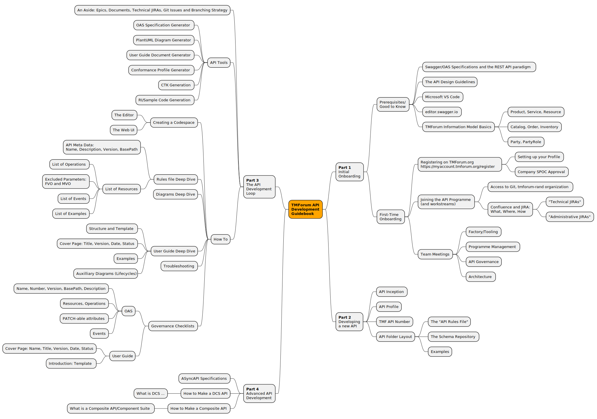

# IG1353 TMForum API Developers Guide
A "How To" Guide for API Authors to develop TMForum Open-APIs: What, Where and How

Feel free to contribute by:
- Adding areas to the scope mindmap that you would like to see covered
- Adding text to the AsciiDoc document to explain things
- Raise questions/Git-issues about the work that you see here

## Resources

### Documentation
- [Part 1: Initial Onboarding](part1.adoc) - Prerequisites and first-time setup
- [Part 3: The API Development Loop](part3.adoc) - Development workflow and tools

### Onboarding Materials
- [Onboarding Slide Script](onboarding-slide-script.md) - Complete narrated slideshow script for newcomers
- [Onboarding Slides Outline](onboarding-slides-outline.md) - Quick reference and production guidelines

## A Mindmap of the scope for this guide:

