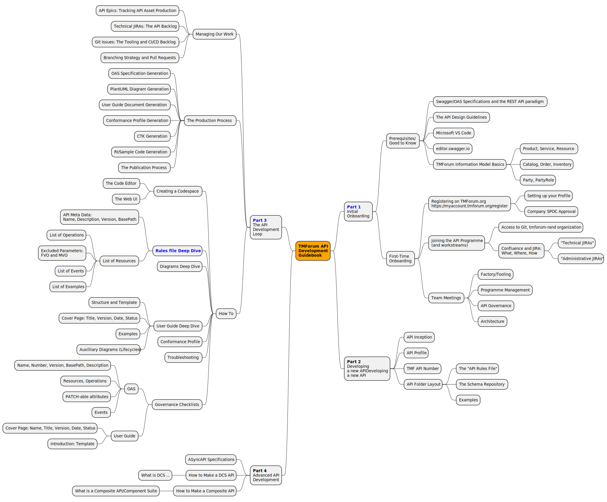

# IG1353 TMForum API Developers Guide

A "How To" Guide for API Authors to develop TMForum Open-APIs: What, Where and How

Feel free to contribute by:
- Adding areas to the scope mindmap that you would like to see covered
- Adding text to the AsciiDoc document to explain things
- Raise questions/Git-issues about the work that you see here

## Resources

### Documentation

- [Part 1: Initial Onboarding](part1.adoc) - Prerequisites and first-time setup
- [Part 3: The API Development Loop](part3.adoc) - Development workflow and tools

### Onboarding Materials

- [Onboarding Slide Script](onboarding-slide-script.md) - Complete narrated slideshow script for newcomers
- [Onboarding Slides Outline](onboarding-slides-outline.md) - Quick reference and production guidelines

## A Mindmap of the scope for this guide:

## Development

### Dependencies

The asciidoc files are rendered with Ruby/Asciidoctor

- https://www.ruby-lang.org/ - Required for running asciidoctor (version 2.6 or higher recommended)
- https://asciidoctor.org/ - Converts AsciiDoc to HTML
  gem install asciidoctor
- https://github.com/asciidoctor/asciidoctor-pdf - Converts AsciiDoc to PDF
  gem install asciidoctor-pdf
- https://github.com/asciidoctor/asciidoctor-diagram - Enables diagram support (PlantUML, Graphviz, etc.)
  gem install asciidoctor-diagram

### Usage

Run the `./render.sh` command to get PDF and HTML versions of the documents in the `output/` folder.
