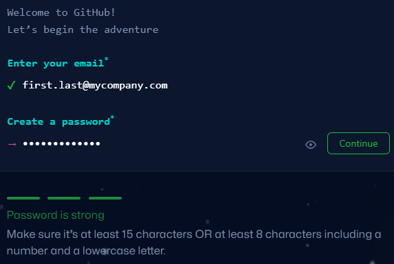
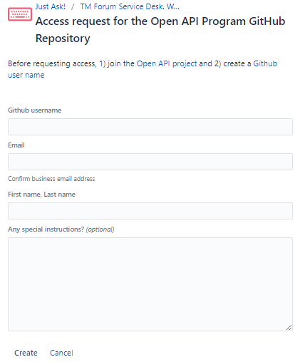

= TMForum API Developer's Handbook Part 1, Initial Onboarding
TM Forum Specification
Revision
:Revision: 1.0.0
:Date: 15-Mar-2024
:IPR-Mode: RAND
// RAND = Reasonable and Non-Discriminatory licensing terms
:TMF-Number: TODO
:Status: DRAFT
:Release-Status: Pre-production
:url-repo: https://github.com/tmforum-rand/ig1353-api-developers-guide
:doctype: book
:toc: 

== Executive Summary

TMForum (TM Forum) is the global industry association for communications service providers and their suppliers. The organization develops industry standards, including Open APIs (Application Programming Interfaces), to enable interoperability between different systems and accelerate digital transformation in the telecommunications industry.
This “How To” document set provides onboarding instructions and a user-guide for the TMForum Open-API development tools. The document is organized in multiple parts as follows:

[options=header]
|===
|Document Part |Summary

|*Part One: Initial Onboarding* |Prerequisites/Good To Know, First-Time Onboarding
|*Part Two: Starting a New API* |API Inception, API Profile, Getting an API Number
|*Part Three: The API Development Loop* |Admin: JIRA issues, Git issues and Branching, API Tools, How To Deep-Dives
|*Part Four: Advanced API Development* |ASyncAPI Specifications, How to make a DCS (Domain Composite Service) API, How to make a Composite API
|===

This part (Part One) of the document provides a high-level overview and references of the background knowledge that you will need as you progress with TMForum API development, as well as the one-time registration details and permissions to get into the API "Author's Circle" (the group of authorized developers who can contribute to TMForum's private API development repositories).

:sectnums:
== Prerequisites / Good to Know

The TMForum uses a variety of collaboration tools to coordinate the requirements and development of APIs (Application Programming Interfaces):

[options=header,stripes=even]
|===
|Document/Website |What Is It |Further Reading

|Swagger/OAS files |The OpenAPI Specification (OAS) is a framework used by developers to build applications that interact with REST (Representational State Transfer) APIs. REST is an architectural style for designing networked applications. The specification defines how to communicate with an API, what information can be requested, and what information can be returned. | https://swagger.io/specification/[OpenAPI Specification], https://swagger.io/specification/v2/[Swagger 2 Specification]
|TMF Forum API Design Guidelines |REST itself is only a paradigm. The TMForum has written down a number of 'positions' taken in the specific design of REST API specifications, such as Entity CRUD (Create, Read, Update, Delete) operations and Task operations, filtering and attribute selection and many more | https://www.tmforum.org/resources/specification/tmf630-rest-api-design-guidelines-4-2-0/[TMForum API Design Guidelines v4.2.0]
|GitHub and Codespaces |GitHub is a website and cloud-based service that helps developers store and manage their code, as well as track and control changes to their code through Version control. | https://docs.github.com/en/get-started/start-your-journey/hello-world[GitHub: Hello World]
|Microsoft Visual Studio Code |GitHub Codespaces is a cloud-based development environment that allows developers to work on their local development environment on any device and from anywhere. Visual Studio Code is a rich text editor like Sublime Text and Atom. TMForum use a hosted browser-based version of this through Codespaces. | https://docs.github.com/en/codespaces/getting-started/deep-dive[Deep dive into GitHub Codespaces]
|editor.swagger.io |The Swagger Editor is an open source editor to design, define and document HTTP-based and event-driven APIs using the OpenAPI and AsyncAPI specifications, respectively. | https://editor.swagger.io
|JIRA |JIRA is a project management and issue tracking software from https://www.atlassian.com/[Atlassian]. It is used extensively within TMForum for Project and Issue tracking, managing development tasks, and coordinating work across different teams and organizations. | https://www.atlassian.com/software/jira[JIRA]
|Confluence |*Confluence* also from https://www.atlassian.com/[Atlassian] is used extensively for collaborative documentation, meeting notes, and knowledge management within the TMForum API program. | https://www.atlassian.com/software/confluence[Confluence]
|PlantUML | https://plantuml.com/[PlantUML] is a language and tool used to craft UML diagrams by textual description. Class diagrams are auto-generated in PlantUML, and auxiliary diagrams (such as state transition diagrams) can be hand-coded by the author | https://plantuml.com/guide[PlantUML Language Reference]
|Postman |Postman is a tool that TMForum uses to act as a client, to exercise all mandatory aspects of their API specifications. This is used by vendors and operators to certify that their server-side implementation meets the minimum necessary conformance to the specification. | https://learning.postman.com/docs/introduction/overview/[Postman Documentation Overview]

|===

=== TMForum Information Model Basics

As a minimum, a high-level familiarity with the following information model concepts will be essential for your ability to author a TMForum API:

* *Products, Services and Resources*: The fundamental building blocks of telecommunications offerings, where Products are customer-facing offerings, Services are the technical capabilities that deliver Products, and Resources are the physical or logical assets that enable Services.

* *Catalog, Order, Inventory*: The three main operational domains in telecommunications: Catalog contains the definitions of what can be offered, Order manages the customer requests and lifecycle, and Inventory tracks what has been provisioned and deployed.

* *Party and PartyRole*: Party represents individuals or organizations (customers, suppliers, partners), while PartyRole defines the specific roles these parties play in different business contexts (e.g., customer, supplier, partner).

These concepts form the foundation of most TMForum APIs and understanding their relationships is crucial for effective API design and implementation.

== First-Time Onboarding

Before you can begin coding an API, you first need to establish an identity and profile with the TMForum. While API deliverables are largely Apache V2.0 licensed and free for public use, the internal development process is conducted by TMForum members in closed GitHub repositories to ensure quality control and proper governance.

=== Registering on TMForum.org

The first step is to register yourself with https://www.tmforum.org/register. This is a one-time step. If you are a part of an existing TMForum member organization, you will need to use your organization's domain name in the email address that you use to register.

image::images/part1-register.png[Registration,807,726,align="center",link=https://www.tmforum.org/register,window=_blank]

Each member organization has an individual allocated as a single point of contact for TMForum. It is possible that your application to register triggers an email approval to this person, internal to your company. It is worth confirming this with your organization's TMForum account manager to avoid any delay in your registration.

=== Completing Your Profile

Once you are registered, it is worth completing your profile by uploading a *Current Picture* (_jpg, gif or png_). This helps others to identify you in Confluence edits and JIRA issues.

=== Joining the API Programme

Having registered and established a profile, you now need to join the API Program. This is also a one-time step. All TMForum projects are laid out here: https://myaccount.tmforum.org/joinproject. Scroll down this list to the *Open APIs* project and hit *JOIN THE PROJECT*:

image::images/part1-join.png[Joining,618,79,align="center",link=https://myaccount.tmforum.org/joinproject,window=_blank]

Once you have joined this button will become red and you can *VIEW PROJECT*:

image::images/part1-viewProject.png[Joining,618,80,align="center",link=https://myaccount.tmforum.org/joinproject,window=_blank]

This will take you to the API Project Home Page within TMForum.org (https://projects.tmforum.org/wiki/display/AP/Open+API+Project+Home). This is hosted in TMForum's private Confluence site. This home page will lay out the people involved (this is where the photos are useful), the workstreams and team calendar (https://projects.tmforum.org/wiki/display/AP/Open+APIs+calendar). By joining the team you should receive calendar invites to each of the API program meetings.

=== Joining the TMForum's Private GitHub Repository

Independent of the collaboration tools, as an API author you will need access to TMForum's private API Repository. This repository contains the current version (v5) of all TMForum API specifications and related development tools. If you have never used GitHub.com before, you will first need to establish an identity there. If this is your first time with GitHub.com:

. From github.com, select "Sign Up" in the top-right hand corner
. Enter an email address to register with. This need not be the same email as you have used to register with the TMForum website - it could (for example) be your personal email address.
. Enter a strong password

After establishing a GitHub identity - you will need to contact TMForum staff to ask that this is granted access rights to the `https://github.com/tmforum-rand/OAS_Open_API_And_Data_Model` repository.

This is currently done by filling out a simple request form accessed here with your GitHub.com registered email address:
https://projects.tmforum.org/jira/servicedesk/customer/portal/3/create/102

=== Team Meetings

The most up-to-date list of meetings should be available from the above team home page. You are not obliged or expected to attend all of these meetings, but it would be useful to "tune in" to the agendas, priorities and people involved. As a new API developer, attending these meetings will help you understand the collaborative development process and connect with other developers in the community. Some of the main recurring meetings are:

[options=header,cols="25h,~,~",stripes=even]
|===
|Day and Time |Meeting Title |Description

|Monday @ 14:00 GMT/ 15:00 CET/ 10:00 ET|API Factory Call |Discussion of the issues and evolution of the tooling and end-to-end CI/CD process
|Wednesday @ 13:00 GMT/ 14:00 CET/ 09:00 ET|API Program Call |A weekly review of ongoing API developments and general planning (SpecJam etc)
|Wednesday @ 14:00 GMT/ 15:00 CET/ 10:00 ET|API Governance Call |A weekly review of new technical issues raised (improvements, bugs) in existing APIs
|Thursday @ 15:00 GMT/ 16:00 CET/ 11:00 ET|API Architecture Call |A technical discussion of design patterns that might impact our design guidelines

|===

== Administrative Appendix

This Appendix provides additional background material about the TM Forum
and this document. In general, sections may be included or omitted as
desired, however a Document History must always be included.

=== Document History

==== Version History

This section records the changes between this and the previous document
version as it is edited by the team concerned. Note: this is an
incremental number which does not have to match the release number and
used for change control purposes only.

[options=header]
|===
|Version Number |Date Modified |Modified by | Description of changes

|0.1 |15-Mar-2024 | Stephen Harrop |First layout of the basics

|===

=== Acknowledgments

This document was prepared by the members of the TM Forum API team:

* Stephen Harrop, Vodafone, Editor
* Revathi Sivaji, TM Forum, Contributor
* Heidi Lobecker, TM Forum, Contributor
* Uche Uba, TM Forum, Contributor
