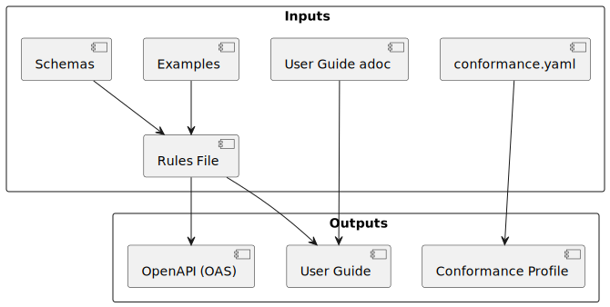
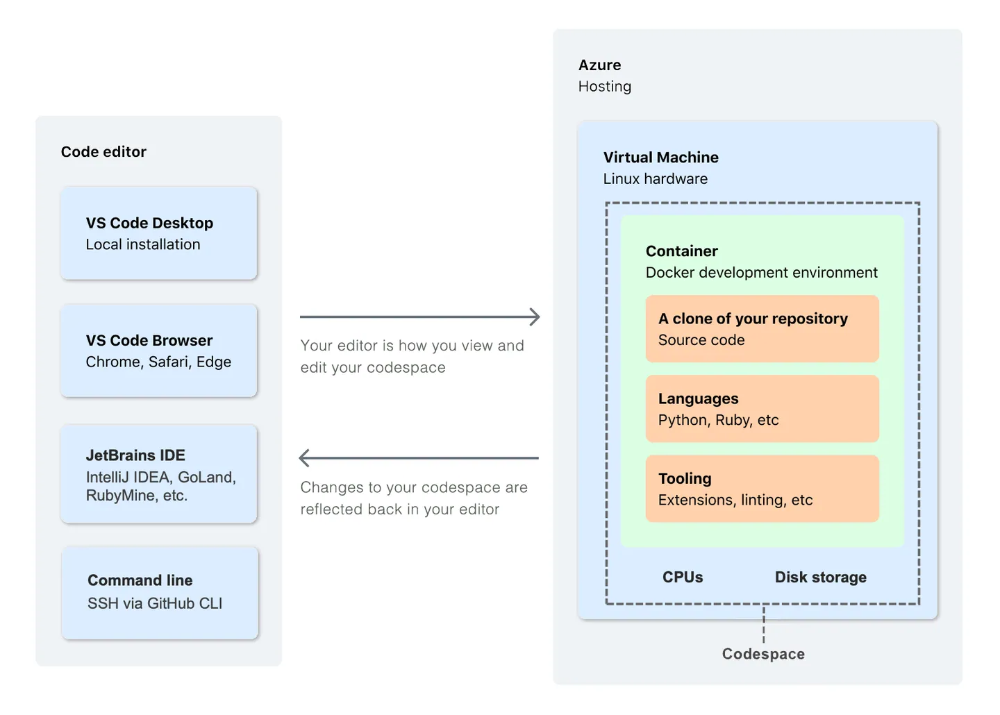
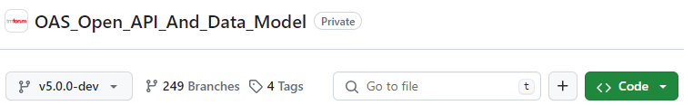
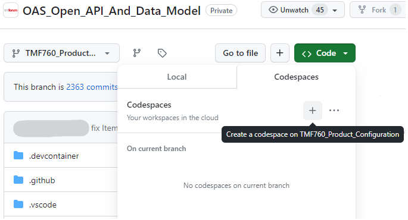
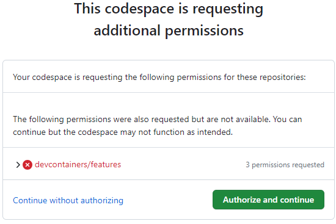
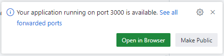
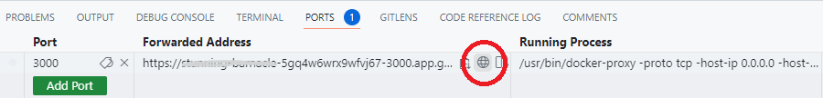

= TMForum API Developer's Handbook Part 3, The API Development Loop
TM Forum Specification
Revision
:Revision: 0.2.0
:Date: 17-Apr-2024
:IPR-Mode: RAND
:TMF-Number: TODO
:Status: DRAFT
:Release-Status: Pre-production
:url-repo: https://github.com/tmforum-rand/ig1353-api-developers-guide
:doctype: book
:toc: 
 
== Executive Summary

This “How To” document set provides onboarding instructions and a user-guide for the TMForum Open-API development tools. The document is organized in multiple parts as follows:

[options=header]
|===
|Document Part |Summary

|*Part One: Initial Onboarding* |Prerequisites/Good To Know, First-Time Onboarding
|*Part Two: Starting a New API* |API Inception, API Profile, Getting an API Number
|*Part Three: The API Development Loop* |Admin: JIRA issues, Git issues and Branching, API Tools, How To Deep-Dives
|*Part Four: Advanced API Development* |API Specialization, Async APIs
|===


This part (Part Three) of the document provides an overview of the API development process, the inputs expected by the API author and the use of the tools to generate the necessary documents.

== Glossary and Abbreviations

Before diving into the technical details, here are key abbreviations and terms used throughout this document:

[options=header,stripes=even]
|===
|Abbreviation |Full Form |Description

|API |Application Programming Interface |A set of protocols and tools for building software applications
|AsciiDoc |AsciiDoc |A lightweight markup language for writing technical documentation  
|CI/CD |Continuous Integration/Continuous Deployment |Automated practices for integrating code changes and deploying applications
|CTK |Conformance Test Kit |TMForum's testing framework to validate API implementations
|EPIC |EPIC |Large work items in JIRA that group related user stories or tasks
|IDE |Integrated Development Environment |Software application providing comprehensive facilities for software development
|JIRA |JIRA |Project management and issue tracking tool from Atlassian
|JSON |JavaScript Object Notation |Lightweight data interchange format
|JQL |JIRA Query Language |Query language used to search for issues in JIRA
|OAS |OpenAPI Specification |A specification for describing REST APIs (formerly known as Swagger)
|PlantUML |PlantUML |Tool for creating UML diagrams from text descriptions
|REST |Representational State Transfer |Architectural style for designing networked applications
|RI |Reference Implementation |Sample code demonstrating how to implement an API
|SID |Shared Information/Data Model |TMForum's standard information model
|TMF |TM Forum |Global industry association for communications service providers
|UML |Unified Modeling Language |Standardized modeling language for software design
|YAML |YAML Ain't Markup Language |Human-readable data serialization standard
|===

:sectnums:
== Managing Our Work

TMForum coordinates API development across multiple companies and timezones using several online collaboration tools. Understanding how work is organized and tracked is essential for effective participation in the API development process.

=== Tracking API Asset Production

TMForum uses JIRA (a project management tool) to track the overall progress of API development. Key concepts include:

* **JIRA Dashboards**: Visual displays showing project status, progress metrics, and key issues
* **EPICs**: Large work items that group related tasks together. Each major API development effort typically has its own EPIC
* **Issues**: Individual work items, bug reports, or feature requests within an EPIC

The JIRA system provides visibility into what APIs are being developed, their current status, and any blockers or dependencies.

=== Technical JIRAs: The API Backlog

The technical backlog in JIRA captures detailed requirements, bugs, and enhancement requests for APIs. Key practices include:

* **Component Attribute Usage**: Each JIRA issue is tagged with a "Component" to identify which API or technical area it relates to
* **Weekly Reviews**: Technical issues are reviewed weekly, but only to achieve consensus on direction rather than detailed technical solutions
* **JQL Reporting**: JIRA Query Language (JQL) is used to create custom reports and filters for tracking specific types of issues
* **EPIC Attachment**: Technical backlog items are linked to their corresponding API EPIC for traceability

Understanding this structure helps newcomers find relevant issues and understand the current priorities.

=== Git Issues: The Tooling and CI/CD Backlog

While business and API requirements are managed in JIRA, technical tooling issues are tracked directly in GitHub:

* **Code-Centric Approach**: Since tooling involves code changes, GitHub Issues provide better integration with pull requests and code reviews
* **Direct Git References**: Issues can be directly linked to specific commits, branches, or pull requests
* **Weekly Reviews**: Tooling issues are also reviewed weekly to ensure development tools continue to meet the team's needs

This separation allows for more efficient tracking of different types of work while maintaining appropriate visibility.

== The Production Process

The TMForum API development process follows a structured approach to transform business requirements into fully documented and tested API specifications. The process involves several automated generation steps:

=== API Project Structure

Each API version folder contains:
 - a configuration file, stating which version of the schemas collection and the tools should be used to generate the outputs for this API
 - a rules file, describing the API interface itself and including examples of API usage
 - a conformance profile, describing the expected behaviour of different API payload prooperties (generated once the rules file is complete)
 - documentation for users of the API

During the development phase, a local copy of the schemas collection can be used and edited; these changes are captured into a new version when the pull request is merged.

=== API Generation Pipeline

The production process consists of several interconnected stages:

1. **OAS Specification Generation**: The OpenAPI Specification (OAS) file is automatically generated from the configuration, API rules file, and JSON schema definitions
2. **PlantUML Diagram Generation**: UML class diagrams are automatically created to visualize the API's data model and relationships
3. **Conformance Profile Generation**: Test specifications are generated to define what constitutes a compliant implementation, authors can edit this file once created
4. **Conformance Profile Document Generation**: Human-readable formatted conformance information
5. **User Guide Document Generation**: The API rules file is combined with the diagrams and additional user guide content to create the User Guide document
6. **Postman Collection Generation**: The OAS file is converted to Postman format

=== Understanding the Dependencies

To author an API, the user creates a series of inputs that are combined to create the API assets we publish for users. An overview of the inputs and the resulting assets is shown in the diagram below:



This automated approach ensures consistency across all deliverables while reducing manual effort and potential errors.

NOTE: The generation tools are designed to be run frequently during development to catch issues early and provide immediate feedback on changes.

== How To

=== Creating a CodeSpace

**What is a CodeSpace?**

CodeSpace (https://docs.github.com/en/codespaces/overview) is a cloud-based development environment that GitHub provides to run your code and tools in the cloud. For TMForum API development, this solves several common challenges:

* **Environment Consistency**: All developers work in identical environments, eliminating "it works on my machine" issues
* **Corporate Firewall Issues**: Codespaces run in the cloud, bypassing restrictive corporate network policies
* **Tool Version Conflicts**: The environment includes pre-configured tools and language versions
* **Quick Setup**: No need to install and configure development tools locally

**TMForum-Specific Benefits:**

The TMForum maintains customized Codespace configurations that include:

* Pre-installed API generation tools
* Correct versions of Node.js, Python, and other dependencies
* TMForum-specific scripts and utilities
* Access to private repositories (once authorized)

**Cost and Resource Limits:**

TMForum covers the hosting costs for authorized developers, with limits on:

* RAM and CPU allocation per instance
* Maximum idle time before automatic shutdown
* Number of concurrent instances per developer

**Important Data Persistence Warning:**



WARNING: If you create a codespace and work on files locally within it - *and then leave it unattended for more than a few days*, Azure will delete the instance and any local work within it will be lost. Your GitHub registered email address will recieve warning emails from <noreply@github.com> as this deadline approaches.
Always remember to check your work back into your branch before you leave, to avoid any loss.

*To create a Codespace*:

. Having logged into GitHub.com with your TMForum registered identity, navigate to the v5 API repository: https://github.com/tmforum-rand/OAS_Open_API_And_Data_Model



[start=2]
. The left hand drop-down in the screenshot above indicates your current branch (shown as `v5.0.0-dev`). Click this and select the appropriate branch for your API work.
. Now click the green "*<> Code*" button to the right. This will list any active codespaces that you may have, and allow you to create a new codespace on this current branch, by selecting the "+" button:



WARNING: Do make sure you are in the *right repository*, and the *right branch* before doing this - to ensure that GitHub spins up the right configuration for you.

[start=4]
. The codespace will request permissions related to spinning-up the Azure instance. Hit "*Authorize and continue*":



[start=5]
. The codespace will now start up, which may take a minute to produce the initial Microsoft Code IDE within your browser. It will take a further few minutes to run up a docker instance from the terminal window at the bottom. This will finish when the following popup appears in the bottom-right of the browser:



This application presents a simplified menu-driven front-end to the API tooling. Hit "*Open in Browser*" to see this appear in another tab - but you can ignore it for now, we will get back to it later.

If you have ever closed this tab and need to recreate it, click on the *PORTS* tab at the bottom of the main IDE window. Here you should see a single *Port*: 3000 line with column titles of *Forwarded Address*, *Running Process*, *Visibility* and *Origin*. Hover your mouse over the URL under *Forwarded Address* and you should see a small globe icon (highlighted in the circle below):



If you click on this globe icon, the Web UI tab should be recreated.

*Back in the main IDE tab*: If you use Microsoft's Visual Studio Code IDE (https://code.visualstudio.com/), this will be a familiar layout, but presented through a web browser to an instance running in the Azure cloud, and looking at the TMForum v5 API repository. You can browse and modify files, and changes will be tracked for you to stage and commit from within the IDE back into this Git repository.

This link (https://docs.github.com/en/codespaces/getting-started/quickstart) describes the basics of using Codespaces, including source control and extensions.

== Rules File Deep Dive

The TMF API rules file, along with JSON schema files - form the main areas of influence in the construction of a TMF API. Your main activity will be in crafting this rules file together with the associated JSON-Schema files to ensure that the naming and description of entities, properties, operations, notifications and overall structure "hang together" to describe your intensions in agreement with the TMForum API Design Guidelines.

The rules file is a YAML file (https://en.wikipedia.org/wiki/YAML), written in a Domain-Specific Language invented within the TMForum. Its purpose is to describe the high-level structure of the generated OAS file, and it is the main input to the TMF OAS generator.

=== Basic API Properties

This section describes the metadata required at the beginning of a rules file.
It defines the essential properties that identify and describe the API, as well as how these values map into the generated OpenAPI Specification (OAS) file.

[cols="1,1,1,3"]
|===
|Property |Type |Required |Description

|`name`
|string
|Yes
|Full API name for documentation.
Appears in the OAS file in the `info.title` attribute.

|`description`
|string
|No
|API description text.
Appears in the OAS file in the `info.description` attribute.
Supports CommonMark Markdown. Keep concise and avoid special non-ASCII characters or formatting tags.

|`tmfId`
|string
|No
|TM Forum identifier allocated to this API.
Format: `TMFxxx` (three or more digits).
Used by tooling but does not map directly to OAS.

|`shortName`
|string
|Yes
|Short API identifier for constructing names.
Must match the pattern: `^[a-zA-Z0-9]{3,}`.
Used in contexts requiring concise identifiers (e.g., code generation, references).

|`hostUrl`
|string
|No
|Base host URL of the API.
Translates into the `servers.url` attribute in the OAS file.
Note: in older TMF-v4 rules files, `basePath` was used instead, but this is ignored in OAS generation.

|`basePath`
|string
|No
|API base path appended to `hostUrl`.
**Note:** This is retained for compatibility but ignored in OAS generation.

|`version`
|string
|No
|API version number following https://semver.org[SemVer] format: `<major>.<minor>.<patch>`.
Appears in the OAS file as `info.version`.

|`resources`
|array
|Yes
|List of resource definitions belonging to the API.
|===

=== Example Rules File

A minimal rules file with annotated metadata:

[source,yaml]
----
rulesVersion: 1.0.0                                         # <1>
api:
  name:        MyAPI                                        # <2>
  shortName:   MyAPI                                        # <3>
  description: MyAPI description                            # <4>
  tmfId:       TMF123                                       # <5>
  hostUrl:     'https://serverRoot/tmf-api/MyAPI/v5/'       # <6>
  version:     5.0.0                                        # <7>
  resources:
    # Resource definitions go here
----
<1> Version of the rules file format itself, not the API. Rarely changes.
<2> Full name of the API, appears in `info.title`.
<3> Short identifier for the API, without spaces or special characters.
<4> Concise description, appears in `info.description` and supports https://spec.commonmark.org/current/[CommonMark markdown].
<5> TMF identifier, e.g., `TMF678`. Used by tooling only.
<6> Base host URL, becomes `servers.url` in OAS.
<7> API version, SemVer formatted, becomes `info.version`.

WARNING: New API development is typically started by copying and pasting an existing, working rules file from another API directory. While this is fine, and encouraged - do take the time to go through the above line-by-line to ensure that you have updated the values to reflect your new API.
Old API values are unlikely to throw tooling errors and will need to be caught by human review. If you take this review time up-front, it will prevent problems permeating the OAS file, User Guide and other published artifacts.

=== Resource Definitions

Resources are the core entities in your API. Each resource must have a name and schema reference.

[cols="1,1,1,3"]
|===
|Property |Type |Required |Description

|`name`
|string
|Yes
|Resource name, becomes the Path/endpoint name in the OAS and usually matches the schema name (pattern: `[A-Z][A-Za-z]+`)

|`schema`
|string
|Yes
|Reference to the file that contains the schema

|`parent`
|string
|No
|Parent resource name for child resources

|`excludeEndpoints`
|boolean
|No
|Skip endpoint generation for this resource (default: false)

|`isAbstract`
|boolean
|No
|Skip type mapping generation for this resource (default: false)

|`isTask`
|boolean
|No
|Mark as task resource (default: false)

|`supportedHttpMethods`
|object
|No
|HTTP method configurations

|`notifications`
|array
|No
|Event/notification definitions

|`examples`
|array
|No
|Resource example payloads

|`extensions`
|array
|No
|Resource extensions
|===

=== Resources example

[source,yaml]
----
resources:
  - name: CustomerBill
    schema: "schemas/Tmf/Customer/CustomerBill.schema.json#/definitions/CustomerBill"
    supportedHttpMethods:
     GET:
       required: true                                                             <1>
     POST:
       required: true
       requiredParameters:                                                        <2>
        - description
       parameterRestrictions:                                                     <3>
        - id
        - href
        - status
    notifications:
      # Event definitions
    examples:
      # Resource examples
----
<1> For each operation, you can state whether this is required in every implementation of this API. For example, you might decide that a Trouble Ticket API does not make sense without the ability to at least *GET* one or more Trouble Tickets from a ticketing server implementation. In which case, you would state `required: true`. This has no direct translation to the generated OAS file, but the  operation will be mentioned as required in the user guide, and it will cause the TMForum Conformance Test Kit (CTK) to insist that this operation exists and is tested - in order to gain TMForum _conformance_ to this API.
<2> For some operations (POST, PATCH), it can make sense to insist that certain properties are present in the submitted payload from the client. You might decide that an entity MUST at least have a _name_, _description_, _value_ or some combination - for it to make sense. In which case, you would list these properties under `requiredParameters`.
<3> Conversely, you can also insist that certain properties from your canonical resource are *not* submitted by the client with POST-ing a payload. For example it is typically for the producer to decide on properties like *status* or *creationDate*. You would list these under `parameterRestrictions`.

Add an array entry to the resources collection for each resource that is included in your API. The name field dictates the path, in this example `/CustomerBill`.

=== *Notifications*

Describe the operations and notifications for each resource. The following operations may suggest these event notifications:

[options=header]
|===
|Operation |Typical Event Notifications
|GET | _none_
|POST | createEvent, statusChangeEvent, 
|PATCH | attributeValueChangeEvent
|DELETE | deleteEvent

|===

NOTE: There are many opportunities to reference example files for the full resource and operation requests and responses. *These are all optional to the generation of the OAS file itself*. While they will be needed for the full publication of the API, its user guide and CTK - we would recommend focussing on the OAS construction and approval before working on the examples, as changes to the structure and schemas of the API will cause a lot of rework to these examples.

==== *JSON-Schemas*

The API rules file implicitly makes references to a number of JSON-Schema files. Each resource named under the `resources:` section above as well as each event type named under the `notifications:` section will cause the OAS generator to search in the schema repository (`OAS_Open_API_And_Data_Model/tree/<YourBranch>/schemas`) for a JSON-Schema file fitting the format: `<MyResource>.schema.json`. In parsing _that_ JSON-Schema file, it will follow any `$ref` references to other JSON-Schema files, each defining a JSON object type and representing a business entity, until it has achieved a transitive-closure of all dependent schemas. This dependency graph will then form the `components.schemas` section of the resultant OAS file, so that all references can be resolved within the API specification.

*Schema Repository Structure*

The schema files defining the business entities that build up the API's resources are placed in the schema repository with the "*schemas*" directory as its root.

Within that structure, schemas of TMF defined entities are placed in the "*Tmf*" subdirectory and further in the subdirectory named according to the TMForum Information Model ("_SID_") domain *<Domain>* to which the entity belongs. Do take care when creating new entities to consider the right domain to place your JSON-Schema file.

Following the above pattern for schema files for resources, the schema file defining the entity *<Entity>* is named according to the pattern `<Entity>.schema.json`.

A schema file defining for an *<Entity>* an event *<Event>* is named `<Entity><Event>.schema.json`, and its payload is defined by a file `<Entity><Event>Payload.schema.json`. Both these kinds of files are placed in the "*Event*" subdirectory.

The resulting directory structure is as follows:


*Schema File Structure*

A cut down TMForum JSON-Schema file for a fictitious `Document` entity looks like this:
[source, json]
----
{
  "$schema": "http://json-schema.org/draft-07/schema#",                            <1>
  "$id": "Document.schema.json",                                                   <2>
  "title": "Document",                                                             <3>
  "definitions": {
    "Document": {                                                                  <4>
      "$id": "#Document",                                                          <5>
      "type": "object",
      "description": "Document is a tangible output from an activity",             <6>
      "properties": {                                                              <7>
        "name": {                                                                  <8>
          "type": "string",
          "description": "A string used to give a name to the document"
        },
        "size": {                                                                  <9>
          "type": "integer",
          "description": "The size of the Document"
        },
        "isEncrypted": {                                                           <10>
          "type": "boolean",
          "description": "An example for a boolean attribute"
        },
        "creationDate": {                                                          <11>
          "type": "string",
          "format": "date-time",
          "examples": [                                                            <12>
            "2025-04-16T00:00:00Z"
          ],
          "description": "The date and time when the document was created"
        },
        "validFor" : {                                                             <13>
          "$ref": "../Common/TimePeriod.schema.json#/definitions/TimePeriod",      <14>
          "description": "The period of time during which this Document is valid"  <15>
        },
        "characteristic": {                                                        <16>
          "type": "array",
          "items": {
            "$ref": "../Common/Characteristic.schema.json#/definitions/Characteristic"
          }
        }
      },
      "allOf": [                                                                   <17>
        {
          "$ref": "../Common/Entity.schema.json#/definitions/Entity"
        }
      ],
      "required": [ "name" ]                                                       <18>
    }
  }
}
----

Representing the name of the entity as <Entity>, the elements of the schema are:

<1> This is the version of JSON-Schema grammar that is being followed.
+
Fixed value, no [Entity] dependence.
Note that we are using https://json-schema.org/draft-07[Draft-07 of JSON Schema].

<2> This is using the filename of the JSON-Schema file as the unique $id of this schema.
+
MUST fit the pattern `[Entity].schema.json`.

<3> This is the JSON-Schema name of the business entity.
+
MUST fit the pattern `[Entity]`.

<4> This is opening the schema definition for this entity.
+
MUST fit the pattern `[Entity]`.
+
Note that this name together with its location within the schema is used in `$ref` references to this entity as target of the JSON Pointer, i.e. as `/definitions/[Entity]`.

<5> This is using the entity name of the JSON-Schema as the unique $id of this definition
+
MUST fit the pattern `#[Entity]`.
+
<6> This is the description of this business entity.
+
This description is copied into the API Specification (OAS file) and the API User Guide.
+
Try to be concise, and imagine this text appearing as a "tooltip" in an IDE. Note also that it appears in all APIs that directly or indirectly refer to this entity, so it should explain the entity without referring to the context of the rules file or schema file referring to it.

<7> The `properties` node contains the list of attributes and relationships associated with this entity definition.

<8> This `name` is a simple string attribute with no further restriction. Its description - as that of all attributes - is copied into the API Specification (OAS file) and the API User Guide and is used for display by tools like IDEs.
+
More specific definitions can be achieved by adding a `format`, e.g. `uri`, `uri-reference` and similar.
+
The values of string attributes can be further restricted by adding any of `minLength`, `maxLength`, `pattern` (a regular expression), `enum` (with a list of allowed values).

<9> Numeric attribute definitions can be typed as `integer` or `number`.
+
The `format` keyword can be used to define an `integer` more specific as `int32` or `int64`, and a `number` as `float` or `double`.
+
Further restrictions on numeric values can be `minimum`, `exclusiveMinimum`, `maximum`, `exclusiveMinimum`, `enum` (with a list of allowed values).

<10> Boolean attributes can take on the values `true` and `false`.

<11> Date and time attributes are modelled as type `string` with a `format`, possible values are `date`, `time` and `date-time`.

<12> A list of example values for an attribute can be provided.
+
Note that although JSON Schema supports an array of examples, Open API Specification only supports a single valued "example" element; thus only the first of the provided example values is copied to the OAS file.

<13> A composite sub-entity defined in another JSON Schema file.

<14> The reference to the JSON Schema file defining the sub-entity.
+
See below for the pattern defining the format of references.

<15> The description of the sub-entity in context of this entity.
+
Note that the according to the OpenAPI Specification, any sibling to a `$ref` reference shall be ignored. Tools like the https://editor.swagger.io/[swagger editor] will complain about this description, and use only the description coming from the referred schema.
+
Nevertheless, the TMF tooling copies this description into the API Specification (OAS file) and the API User Guide.

<16> This `characteristic` is a collection of _things of type Characteristic_, where the _Characteristic_ entity is itself defined in its own JSON-Schema file, being referenced (`$ref`) here. Collections are modelled as ordered `array` (thus having an array-index) of `items`.
+
Note that there must be \#/definitions anchor to the ref location as in this example : "$ref": "../Common/Characteristic.schema.json#/definitions/Characteristic"
+
Collections can further be restricted by `minItems`, `maxItems`, `uniqueItems`.

<17> Many TMForum "managed entities" typically include _all of_ the properties of the `Entity` schema. This makes them `Addressable` (having an `id` and `href`) and Extensible (having `@type`, `@baseType` and `@schemaLocation`). Other "base" entities can also be used to realize more "specialized" entities.

<18> The `required` section is an opportunity to list which of the above properties are "required" as a minimum to establish the main entity. In the above example you could say that a Document _is not a Document_ unless it at least has a `name` property.

NOTE: In some cases (see the following example), a schema is defined as a _one of_ choice between several alternative structures.

An example of a TMForum JSON-Schema modelling a choice looks like this:
[source, json]
----
{
  "$schema": "http://json-schema.org/draft-07/schema#",
  "$id": "DocumentRefOrValue.schema.json",
  "title": "DocumentRefOrValue",
  "definitions": {
    "DocumentRefOrValue": {
      "$id": "#DocumentRefOrValue",
      "type": "object",
      "description": "A Document provided by reference or by value",
      "oneOf": [                                                                   <19>
        {
          "$ref": "../Common/Document.schema.json#/definitions/Document"
        },
        {
          "$ref": "../Common/DocumentRef.schema.json#/definitions/DocumentRef"
        }
      ]
    }
  }
}
----

*Format of References*

References JSON Schema file containing entity definitions exist in the API Rules Files as well as in the JSON Schema files, and by the TMF tooling are resolved recursively to generate the API's OAS file. TMF OpenAPIs apply the https://spec.openapis.org/oas/v3.0.1[OpenAPI Specification 3.0.1], so that the details of that OAS version must be considered.

For OAS 3.0, reference resolution is accomplished as defined by the https://datatracker.ietf.org/doc/html/draft-pbryan-zyp-json-ref-03[JSON Reference] specification and not by the JSON Schema specification.

The "$ref" string value contains a https://datatracker.ietf.org/doc/html/rfc3986#section-4.1[URI-reference], which identifies the location of the JSON value being referenced.

Within the TMF OpenAPI repository, only https://datatracker.ietf.org/doc/html/rfc3986#section-4.2[Relative References] of type "no-scheme" are used. It consists of a relative _path part_, i.e. a sequence of path segments separated by, but not starting with a slash ("/") character, followed by a hash ("#") character as separater and a _fragment part_.

_Path-Part_

In the _API Rules files_, the reference to a resource's JSON Schema file is relative to the root of the OpenAPI repository (`OAS_Open_API_And_Data_Model/tree/<YourBranch>`). Following the above defined Schema Repository Structure, its path part begins with `schema/Tmf/<Domain>`, possibly followed by `Event` segments, and the schema file name `<Entity>.schema.json`, resulting in any of the following alternatives:

* References to a standard <Entity> or related <Event> schema file:

  schema/Tmf/<Domain>/<Entity>.schema.json
  schema/Tmf/<Domain>/Event/<Entity><Event>.schema.json

Note that event payload schemas are only referred by their respective event schema.

In the _JSON Schema files_ within the schema repository, references to another JSON Schema file is relative to the referring schema file. If necessary to navigate into adjacent or parent locations of the schema repository, the path part can start with the double-dot-segment "..". Any single-dot (".") segment is ignored.

Examples:

* References from an entity schema file to a target entity schema file of the same `<Domain>`:

  <Entity>.schema.json

* References from an entity schema file to a target schemes of a different `<Domain>` (can also be used for references in the same domain):

  ../<Domain>/<Entity>.schema.json

* References from an event schema file to its payload schema file (always located in the same directory):

  <Entity><Event>Payload.schema.json

* References from an event payload schema file to its entity schema file:

  ../<Entity>.schema.json

Note that event payload schemas are only referred by their respective event schema.

_The Fragment Part_

By OAS 3.0, the fragment part should be interpreted as a https://datatracker.ietf.org/doc/html/rfc6901[JSON Pointer], beginning with a "/" and pointing through the JSON tree structure of the referred JSON Schema file. With the above defined structure of the schema files, the fragment part fits the pattern

`/definitions/<Entity>`

==== *Generating an OAS file*

Once you have created your rules file and schema definitions, you can generate the OpenAPI Specification (OAS) file using the TMForum tooling.

**Using the Web UI:**

1. Access the Express WebUI from your Codespace (if you closed the tab, see the Codespace setup instructions earlier in this document)
2. The interface presents a drop-down list of APIs, showing every directory under `OAS_Open_API_And_Data_Model/apis`
3. Select your API from the dropdown list
4. Click the "Generate OAS" button to create the specification
5. Review the generated file and any validation messages

**Using Command Line Tools:**

If you prefer command-line tools or the WebUI is unavailable:

```bash
# Navigate to your API directory
cd /path/to/your/api

# Generate the OAS specification
npm run generate

# View the generated OAS file
cat generated/openapi.yaml
```

**Validation and Review:**

After generation, always review:

* The generated OAS file structure
* Any error or warning messages
* Compliance with TMForum API Design Guidelines
* Consistency with your intended API design

The generation process will fail if there are syntax errors in your rules file or missing schema references, providing immediate feedback on issues that need to be resolved.


=== User Guide Deep Dive

The User Guide is automatically generated from your API rules file and provides comprehensive documentation for API consumers. Understanding its structure helps ensure your API documentation meets professional standards.

==== Structure and Template

The generated User Guide follows a consistent template:

* **Cover Page**: Contains the API title, version, date, and status information from your rules file
* **Table of Contents**: Automatically generated from your API structure
* **API Overview**: Derived from your API description and scope
* **Resource Definitions**: Detailed descriptions of each API endpoint
* **Data Models**: Complete schema documentation with examples
* **Operation Examples**: Request/response examples for each supported operation

==== Examples Integration

Examples play a crucial role in making APIs accessible:

* Resource examples demonstrate typical data structures
* Operation examples show request/response patterns
* Error examples illustrate proper error handling
* All examples are validated against the generated OAS specification

==== Auxiliary Diagrams (Lifecycles)

State transition diagrams and lifecycle illustrations help users understand:

* Entity state changes over time
* Valid operation sequences
* Business process flows
* Error and exception paths

These diagrams are typically hand-crafted using PlantUML and integrated into the generated documentation.

=== Conformance Profile Deep Dive

The Conformance Profile defines exactly what an API implementation must support to be considered compliant with the TMForum specification.

==== Initial Generation

The profile is automatically generated from your rules file, particularly:

* Required operations (marked with `required: true`)
* Mandatory parameters (listed under `requiredParameters`)
* Parameter restrictions (specified in `parameterRestrictions`)
* Required notification events

==== How to Read the Profile

The conformance profile uses a structured format:

* **MUST requirements**: Non-negotiable implementation requirements
* **SHOULD requirements**: Strongly recommended but not mandatory
* **MAY requirements**: Optional features that enhance functionality
* **Test scenarios**: Specific test cases that validate compliance

==== How to Craft a Custom Rule

When standard patterns don't fit your API requirements:

1. **Identify the gap**: Determine what standard conformance rules don't address
2. **Document the requirement**: Clearly specify what behavior is expected
3. **Define test criteria**: Establish how compliance will be measured
4. **Add custom validation**: Implement additional checks in your rules file
5. **Update documentation**: Ensure the User Guide reflects the custom requirements

Custom rules should align with TMForum API Design Guidelines while addressing specific domain needs.

=== Configuration File Deep Dive

The configuration file is named `config.yaml` and holds options about the API build process rather than the API itself.
The available configuration options are described in table below:

[cols="2,8"]
|===
2+h**|oasTooling**

|version
|Set the tooling version to use, the list of available versions is here (usually use the newest): https://github.com/tmforum-rand/oas-tooling/releases. A value of `latest` may also be used during API development.

2+h|**schemas**

|version
|Find the available schema collection versions here: https://github.com/tmforum-rand/oas-tooling/releases and update this value when working on a new version of an API. A value of `latest` may also be used during API development.

|devMode
|Optional, default false. Add this configuration set to true when working on a pull request that includes schema changes.
|===

When published, the configuration file does not include `devMode`. It also uses specific versions rather than `latest`.

=== Troubleshooting

API development can encounter various technical issues. This section provides guidance on common problems and their solutions.

==== Codespace "Express" WebUI Issues

The Express WebUI provides a user-friendly interface for API generation, but several issues can occur:

**When the WebUI Stops Working:**

* **Symptom**: The web interface becomes unresponsive or shows errors
* **Solution**: Restart the service by closing and reopening the browser tab, or restart the Codespace entirely
* **Prevention**: Avoid leaving the WebUI idle for extended periods

**Generation Problems:**

* **Symptom**: API generation fails or produces unexpected results
* **Diagnosis**: Check the underlying log files for detailed error messages
* **Location**: Look for `log.log` files in your API directory
* **Analysis**: Error messages often point to specific lines in your rules file or schema files

==== Common Validation Issues

**Examples Not Validating Against OAS:**

* **Common Issue**: Example payload files are validated against the generated OAS specification. This produces a common source of initial errors as you iterate on the payload to make sure the payload matches the expected syntax of the OAS file.
* **Solution**: Carefully review validation errors and adjust your examples to match the schema requirements
* **Best Practice**: Keep examples simple and closely aligned with your schema definitions

**Schema Reference Errors:**

* **Symptom**: Generation fails with "schema not found" errors
* **Cause**: Incorrect file paths or missing schema files
* **Solution**: Verify all `$ref` paths are correct and target files exist

**Rules File Syntax Issues:**

* **Symptom**: YAML parsing errors during generation
* **Cause**: Incorrect indentation or invalid YAML syntax
* **Solution**: Use a YAML validator or IDE with YAML support to check syntax

==== Getting Help

When troubleshooting becomes difficult:

1. **Check the logs**: Always start with the detailed log files
2. **Review recent changes**: Compare your current rules file with the last working version
3. **Test incrementally**: Comment out sections to isolate the problem
4. **Consult the community**: Use GitHub Issues for tooling problems or JIRA for API-specific questions

=== Governance Checklists

Quality assurance is critical for TMForum APIs. These checklists provide quick visual tests to catch common issues before they propagate through the generation process.

==== Rules File Quality Checklist

As people often start a new rules file with a copy-and-paste from a previous existing file - it is easy for "working errors" to permeate unnoticed. Review these items carefully:

**API Metadata:**

* **API Name**: Follows TMForum naming conventions (typically ends with "Management" for resource management APIs)
* **API Version**: Strictly follows SemVer.org format (major.minor.patch, e.g., "5.0.0")
* **API Description**: Concise and clear, avoiding formatting characters and non-ASCII symbols
* **TMF ID**: Correct three-digit TMForum identifier (e.g., "TMF620")
* **Host URL**: Uses correct server URL format, not legacy `basePath` attribute

**Common Copy-Paste Errors:**

* API name updated from source template
* TMF ID changed from source template
* Resource names reflect your API, not the source API
* Schema references point to your domain directory
* Example file paths updated to your API structure

**Technical Validation:**

* No errors in Express UI checklist tab
* No errors in Express UI examples validation
* No errors in generation output window
* No errors in pull request validation checks

==== Schema Files Quality Checklist

Schema files define the structure of your API data. Common issues include:

**Reference Format:**

* All `$ref` paths use correct format: `../Domain/EntityName.schema.json#/definitions/EntityName`
* Schema file names match entity names exactly
* Directory structure follows TMForum conventions

**Description Quality:**

* Attribute descriptions are generic enough for reuse across APIs
* Common schema descriptions avoid API-specific references
* All required fields have clear descriptions

**Schema Validation:**

* JSON schema syntax is valid
* All referenced schemas exist
* Required fields are appropriate for the entity
* Data types are correctly specified

==== Examples Quality Checklist

Examples are crucial for API usability. Verify:

**Reference Examples:**

* All `<Entity>Ref` examples include required fields
* `@referredType` field is properly populated
* `id` and `href` values are consistent with each other

**Notification Examples:**

* **Create events**: Payload shows the complete entity
* **Attribute change events**: Payload shows only `@` properties, `id`, `href`, and changed properties
* **Status change events**: Payload shows only `@` properties, `id`, `href`, and status/state changes
* **Delete events**: Payload shows only `@` properties, `id`, and `href`

**PATCH Operation Examples:**

* All four PATCH formats included (JSON Merge Patch, JSON Patch, etc.)
* Both request and response examples provided for each format
* Examples demonstrate realistic use cases

**Data Consistency:**

* `id` values match the last segment of corresponding `href` values
* Placeholder values replaced with realistic data
* Examples validate against the generated OAS specification

Use these checklists during development and before submitting APIs for review to ensure high quality and consistency.

==== Submitting Your API for Review

Please consider the following checklist before submitting your API for review:

* No errors are shown on the Checklist tab in the Express UI after selecting your API
* No errors are shown on the Examples tab in the Express UI after selecting your API and choosing to validate examples
* No errors are shown in the output window of the Express UI when you generate the various assets (OAS file, user guide, conformance profile)
* No errors are shown at the bottom of your pull request, as a result of running the automatic validations.
* In your examples, ensure that `<entity>Ref` examples include the correct fields, including `@referredType` populated
* In your examples for notifications, ensure that you abide by the rules:
** Create event – the payload should show the entire entity
** Attribute change event – the payload should show only the `@` properties, `id`, `href`, and the changed properties (in PATCH Merge format)
** Status change event – the payload should show only the `@` properties, `id`, `href`, and the changed status/state value
** Delete event – the payload should show only the `@` properties, `id`, `href`
* In your examples for PATCH operation, ensure that you have all four example formats, with both request and response for each example
* In your examples, ensure that the `id` and `href` are consistent with each other (basically the `id` should be identical to the last part of the `href`, after the rightmost `/` character)
* If you use the example generation tool, ensure that you have replaced all the placeholder dummy strings and values with realistic values


== Administrative Appendix

This Appendix provides additional background material about the TM Forum
and this document. In general, sections may be included or omitted as
desired, however a Document History must always be included.

=== Document History

==== Version History

This section records the changes between this and the previous document
version as it is edited by the team concerned. Note: this is an
incremental number which does not have to match the release number and
used for change control purposes only.

[options=header]
|===
|Version Number |Date Modified |Modified by | Description of changes

|0.1.0 |18-Mar-2024 | Stephen Harrop |First layout of the basics
|0.2.0 |17-Apr-2025 | Lutz Bettge |Schema Repository, details of Schema File, Reference Format 

|===

=== Acknowledgments

This document was prepared by the members of the TM Forum API team:

* Stephen Harrop, Vodafone, Editor
* Revathi Sivaji, TM Forum, Contributor
* Heidi Lobecker, TM Forum, Contributor
* Uche Uba, TM Forum, Contributor
* Lutz Bettge, Deutsche Telekom, Contributor
* Olivier Arnaud, Orange, Contributor
