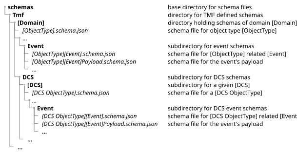

= Reference 2: JSON Schema Format

TMForum API entity definitions use http://json-schema.org/draft-07[JSON Schema Draft-07]. This page documents the structure conventions, supported attribute patterns, and `$ref` path rules used in the TMForum schema repository.

For authoring task steps, see xref:../runbooks/05-create-update-json-schemas.adoc[Runbook 5: Create or Update JSON Schema Files].

== Repository Location

Schema files are placed under the `schemas/` directory in the API repository:

[cols="2,3", options="header"]
|===
|Path pattern |Contents

|`schemas/Tmf/<Domain>/<Entity>.schema.json`
|Entity schemas for TMForum-defined types

|`schemas/Tmf/<Domain>/Event/<Entity><Event>.schema.json`
|Event schemas (e.g., `CustomerBillCreateEvent.schema.json`)

|`schemas/Tmf/<Domain>/Event/<Entity><Event>Payload.schema.json`
|Event payload schemas
|===

== Standard Entity Schema Structure

[source,json]
----
{
  "$schema": "http://json-schema.org/draft-07/schema#",   // <1>
  "$id": "<Entity>.schema.json",                           // <2>
  "title": "<Entity>",                                     // <3>
  "definitions": {
    "<Entity>": {                                          // <4>
      "$id": "#<Entity>",                                  // <5>
      "type": "object",
      "description": "<Clear, reusable description>",      // <6>
      "properties": { ... },                               // <7>
      "allOf": [
        { "$ref": "../Common/Entity.schema.json#/definitions/Entity" }
      ],
      "required": ["name"]
    }
  }
}
----

<1> Fixed value. All TMForum schemas use JSON Schema Draft-07.
<2> Must equal the filename exactly.
<3> Must equal the entity name exactly.
<4> Must equal the entity name exactly. This key is used in `$ref` fragment paths.
<5> Must be `#<Entity>`.
<6> Write descriptions as if they will appear as a tooltip in a developer's IDE — concise, self-contained, no reference to any specific API context.
<7> See attribute types below.

== Attribute Types

=== String

[source,json]
----
"name": {
  "type": "string",
  "description": "A human-readable name for the entity"
}
----

Optional constraints: `minLength`, `maxLength`, `pattern` (regex), `enum` (allowed values list), `format` (e.g., `uri`, `uri-reference`).

=== Integer and Number

[source,json]
----
"count": {
  "type": "integer",
  "description": "The number of items"
}
----

Types: `integer` or `number`. Optional `format`: `int32`, `int64` (for integers); `float`, `double` (for numbers). Optional constraints: `minimum`, `maximum`, `exclusiveMinimum`, `exclusiveMaximum`, `enum`.

=== Boolean

[source,json]
----
"isActive": {
  "type": "boolean",
  "description": "Indicates whether the entity is currently active"
}
----

=== Date and Time

[source,json]
----
"creationDate": {
  "type": "string",
  "format": "date-time",
  "description": "The date and time when the entity was created"
}
----

Supported formats: `date`, `time`, `date-time`.

=== Examples on Attributes

[source,json]
----
"creationDate": {
  "type": "string",
  "format": "date-time",
  "examples": ["2025-04-16T00:00:00Z"],
  "description": "..."
}
----

NOTE: JSON Schema supports an array of examples, but OAS 3.0 supports only a single `example` value. Only the first entry in the `examples` array is copied to the generated OAS file.

=== Sub-Entity Reference (`$ref`)

[source,json]
----
"validFor": {
  "$ref": "../Common/TimePeriod.schema.json#/definitions/TimePeriod",
  "description": "The period during which this entity is valid"
}
----

NOTE: Per OAS 3.0 rules, any sibling property to a `$ref` (including `description`) is technically ignored by strict parsers. However, the TMF tooling copies this `description` into the OAS and User Guide, so it should still be provided. Tools like the Swagger Editor may display a warning about this.

=== Array (Collection)

[source,json]
----
"characteristic": {
  "type": "array",
  "items": {
    "$ref": "../Common/Characteristic.schema.json#/definitions/Characteristic"
  },
  "description": "A list of characteristics associated with this entity"
}
----

Optional constraints: `minItems`, `maxItems`, `uniqueItems`.

=== Inheritance (`allOf`)

Most TMForum managed entities extend the base `Entity` schema to gain `id`, `href`, and extensibility attributes (`@type`, `@baseType`, `@schemaLocation`):

[source,json]
----
"allOf": [
  { "$ref": "../Common/Entity.schema.json#/definitions/Entity" }
]
----

Other base types can also be used depending on the entity's role in the SID model.

=== Choice (`oneOf`)

For "Ref or Value" patterns:

[source,json]
----
"definitions": {
  "DocumentRefOrValue": {
    "$id": "#DocumentRefOrValue",
    "type": "object",
    "description": "A Document provided by reference or by value",
    "oneOf": [
      { "$ref": "./Document.schema.json#/definitions/Document" },
      { "$ref": "./DocumentRef.schema.json#/definitions/DocumentRef" }
    ]
  }
}
----

== `$ref` Path Conventions

TMForum schemas use relative URI references. The path part is relative to the location of the *referring* file, not the repository root.

=== From a Rules File

Rules file `$ref` paths are relative to the *repository root*:

  schemas/Tmf/<Domain>/<Entity>.schema.json#/definitions/<Entity>
  schemas/Tmf/<Domain>/Event/<Entity><Event>.schema.json#/definitions/<Entity><Event>

=== From a Schema File

Schema-to-schema `$ref` paths are relative to the *referring schema file's location*:

[cols="2,3", options="header"]
|===
|Scenario |Path pattern

|Same domain directory
|`<Entity>.schema.json#/definitions/<Entity>`

|Different domain directory
|`../<Domain>/<Entity>.schema.json#/definitions/<Entity>`

|Event schema → its payload
|`<Entity><Event>Payload.schema.json#/definitions/<Entity><Event>Payload`

|Event payload → its entity
|`../<Entity>.schema.json#/definitions/<Entity>`
|===

The fragment part always takes the form `/definitions/<Entity>` — pointing to the key in the `definitions` object.

== Event Schema Structure

// TODO: Add a complete worked example of an event schema file and its
// corresponding payload schema file.
// This is a significant gap — new API authors have no template to follow
// for creating notification event schemas from scratch.
