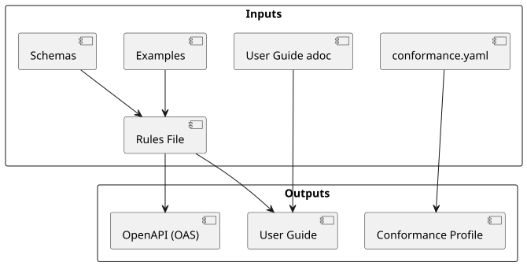

= The API Development Loop: Overview

This document describes the end-to-end workflow for authoring a TMForum Open-API specification. Each step in the loop is documented as a separate runbook; this page explains how they fit together.

== The Development Loop

API development at TMForum is iterative. You will move through the steps below multiple times per API version as requirements evolve and review feedback arrives.

[cols="1,4,2", options="header"]
|===
|Step |What You Do |Runbook

|1 |Raise a JIRA issue and locate your EPIC |xref:01-raise-jira-issue.adoc[Runbook 1]
|2 |Create a development branch in GitHub |xref:02-create-development-branch.adoc[Runbook 2]
|3 |Set up (or reopen) a Codespace |xref:03-setup-codespace.adoc[Runbook 3]
|4 |Create or update the rules file |xref:04-create-update-rules-file.adoc[Runbook 4]
|5 |Create or update JSON schema files |xref:05-create-update-json-schemas.adoc[Runbook 5]
|6 |Generate and validate the OAS file |xref:06-generate-validate-oas.adoc[Runbook 6]
|7 |Generate and review the User Guide |xref:07-generate-user-guide.adoc[Runbook 7]
|8 |Generate and edit the Conformance Profile |xref:08-generate-conformance-profile.adoc[Runbook 8]
|9 |Create and validate examples |xref:09-create-validate-examples.adoc[Runbook 9]
|10 |Submit your API for review (Pull Request) |xref:10-submit-api-for-review.adoc[Runbook 10]
|===

Additional runbooks cover operational tasks that arise during development:

* xref:11-change-tooling-version.adoc[Runbook 11: Change the Tooling Version]
* xref:12-troubleshoot-generation.adoc[Runbook 12: Troubleshoot Generation Failures]

== Inputs and Outputs

The diagram below shows the key files you author (inputs) and the artifacts that the tooling generates from them (outputs).

The inputs you own:

* `rules/<API>.rules.yaml` — the rules file describing your API structure
* `schemas/Tmf/<Domain>/<Entity>.schema.json` — JSON schema files for your entities
* `config.yaml` — tooling and schema version pins
* `documentation/` — cover page fields, example files, auxiliary diagrams

The generated outputs (do not edit directly):

* `<API>.oas.yaml` — the OpenAPI Specification
* `<API>-userguide.adoc` — the User Guide
* `<API>-conformance.adoc` — the Conformance Profile document
* `<API>-postman.json` — the Postman collection

== Where to Start

If you are new to the project, complete xref:../part1.adoc[Part 1: Initial Onboarding] before this loop. If you are starting a brand-new API (rather than updating an existing one), complete Part 2: Starting a New API to obtain your JIRA EPIC and TMF number first.

Once those prerequisites are met, begin at <<Runbook 1>>.
