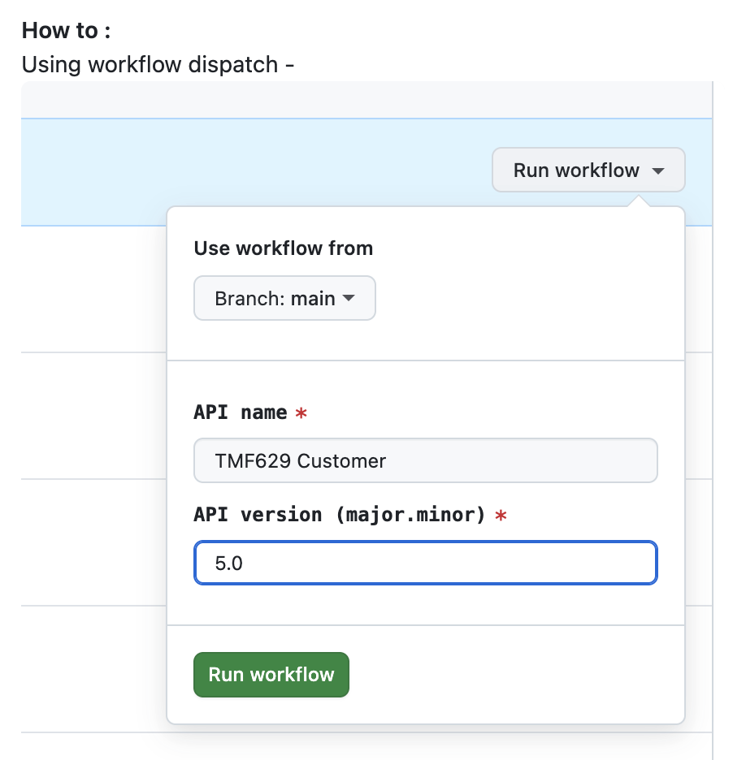

= Runbook 2: Create a Development Branch

== Goal

Create a correctly named feature branch in the TMForum API repository, with the right directory structure already in place.

== Prerequisites

* You have GitHub access to `github.com/tmforum-rand/OAS_Open_API_And_Data_Model` (see Part 1)
* You have a TMF number and API name (from Part 2: Starting a New API)

== Steps

. Navigate to the repository on GitHub and select the *Actions* tab.
. Locate the workflow named *Create Feature Branch* and click on it.
. Click *Run workflow* (workflow dispatch) and fill in:
** API name (e.g., `Customer`)
** TMF ID (e.g., `TMF629`)
** Version (e.g., `5.0.x`)
+

. Click *Run workflow* to trigger. GitHub Actions will automatically:
.. Create a branch named `feature/TMF629_Customer_v5.0.x`
.. Create the correct directory structure for your API
.. Place a default `config.yaml` in the right location

. Once the workflow completes, confirm the new branch appears in the repository's branch list.

== Expected Outcome

A branch named `feature/TMF<NNN>_<APIName>_v<major>.<minor>.x` exists in the repository, containing the scaffold directory structure for your API. You are ready to open a Codespace on this branch (see xref:03-setup-codespace.adoc[Runbook 3]).

== Common Errors

* *Workflow not visible*: You need write access to the repository. Contact TMForum staff if the Actions tab is read-only for you.
* *Wrong branch name created*: The workflow derives the name from your inputs. Double-check the TMF number and API name before running — renaming a branch later is possible but complicates any open PRs.

NOTE: Always use the automated workflow to create feature branches. Manually created branches may lack the required directory structure and will not pass the automated validation checks.
