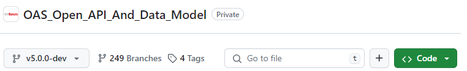
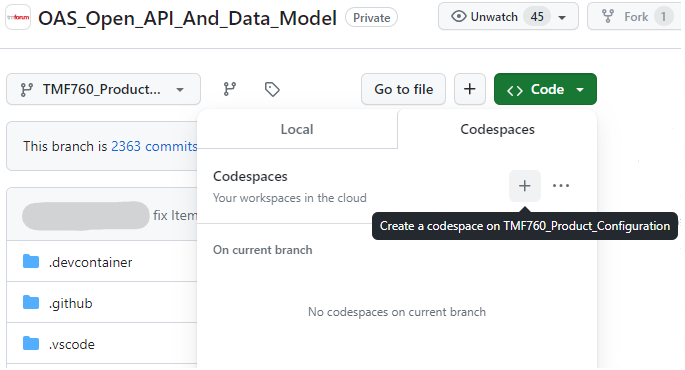
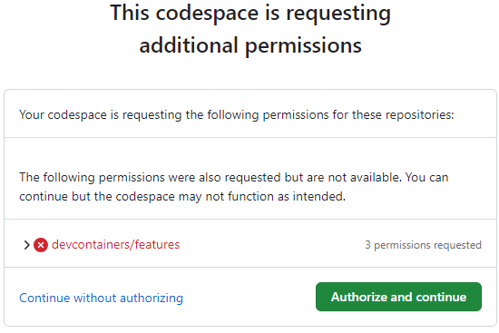
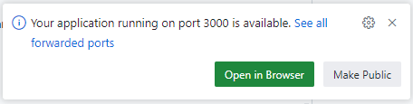
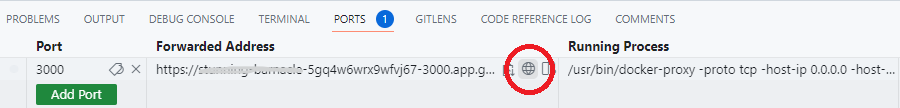

= Runbook 3: Set Up Your Codespace

== Goal

Launch a cloud-based development environment (Codespace) connected to your feature branch, with the API tooling running and accessible via the Express WebUI.

== Prerequisites

* Your feature branch exists (see xref:02-create-development-branch.adoc[Runbook 2])
* You are logged into GitHub with your TMForum-registered identity

== Steps

=== First-Time Setup

. Navigate to the v5 API repository: https://github.com/tmforum-rand/OAS_Open_API_And_Data_Model
+

. Select your feature branch from the branch drop-down (top-left).

. Click the green *<> Code* button, then click *+* to create a new Codespace on this branch:
+

+
WARNING: Verify you are on the correct repository *and* the correct branch before continuing.

. Approve the Azure permissions prompt by clicking *Authorize and continue*:
+

. Wait for the browser-based IDE to load (typically one minute). A Docker container then starts in the terminal pane; this takes a further few minutes. When it is ready you will see:
+

+
Click *Open in Browser* to open the Express WebUI in a new tab.

=== Reopening the Express WebUI

If you close the WebUI tab:

. Click the *PORTS* tab at the bottom of the IDE window.
. Find the row with *Port 3000*.
. Hover over the URL in the *Forwarded Address* column and click the globe icon.
+

=== Returning to an Existing Codespace

If you have already created a Codespace and want to reopen it:

. Go to https://github.com/codespaces
. Find your Codespace in the list and click to reopen it.
. Allow time for the Docker container to restart if it was suspended.

== Expected Outcome

The Express WebUI is open in your browser and shows a dropdown list of available APIs. The IDE shows your feature branch. You are ready to edit files.

== Common Errors

* *WebUI tab not loading*: Use the PORTS tab method above to reopen it rather than refreshing the original tab.
* *"Application Running" popup never appears*: The Docker container may have failed to start. Check the terminal output in the IDE for error messages. See xref:12-troubleshoot-generation.adoc[Runbook 12].
* *Files not saved to branch*: Work in the Codespace is not automatically pushed to your branch. Commit and push your changes from within the IDE before leaving.

WARNING: If a Codespace is left idle for more than a few days, Azure will delete it along with any uncommitted local changes. You will receive email warnings from `noreply@github.com` before this happens. Always push your work before leaving.
